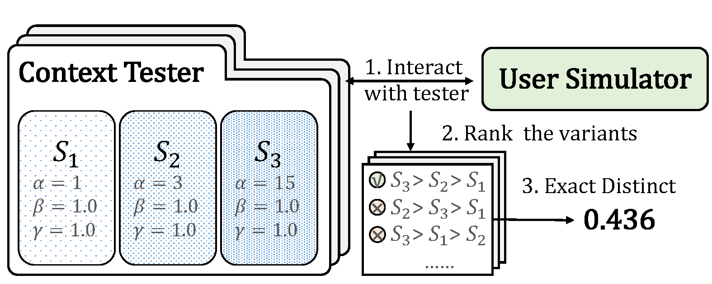

# Simtester

[comment]: <> ([![Pypi Latest Version]&#40;https://img.shields.io/pypi/v/crslab&#41;]&#40;https://pypi.org/project/crslab&#41;)

[comment]: <> ([![Release]&#40;https://img.shields.io/github/v/release/rucaibox/crslab.svg&#41;]&#40;https://github.com/rucaibox/crslab/releases&#41;)
[](./LICENSE)
[](https://arxiv.org/abs/2204.00763)

[comment]: <> ([![Documentation Status]&#40;https://readthedocs.org/projects/crslab/badge/?version=latest&#41;]&#40;https://crslab.readthedocs.io/en/latest/?badge=latest&#41;)

[comment]: <> (| [Docs]&#40;https://crslab.readthedocs.io/en/latest/?badge=latest&#41;)

[comment]: <> (| [中文版]&#40;./README_CN.md&#41;)

**Simtester** is an open-source toolkit for evaluating user simulator of task-oriented dialogue system(TOD). It is
developed based on Python and PyTorch. You can easily construct agents(system variants) with Simtester using either your
own implemented model or our trained model and construct tester with different combinations of agents. In tester-based
evaluation, the user simulator you implemented interacts with agents in the tester, ranks them, and tester calculates
the Exact Distinct score of the user simulator. [[paper]](https://arxiv.org/pdf/2204.00763.pdf)



- [Installation](#Installation)
- [Quick-Start](#Quick-Start)
- [Contributions](#Contributions)
- [Citing](#Citing)
- [Team](#Team)
- [License](#License)

[comment]: <> (## Updates)

[comment]: <> (2022.10.28:)

[comment]: <> (-Add )

## Installation

Simtester works with the following operating systems：

- Linux
- Windows 10
- macOS X

Simtester requires Python version 3.6 or later.

[comment]: <> (Simtester requires torch version 1.4.0 or later. If you want to use CRSLab with GPU, please ensure that CUDA or CUDAToolkit version is 9.2 or later. Please use the combinations shown in this [Link]&#40;https://pytorch-geometric.com/whl/&#41; to ensure the normal operation of PyTorch Geometric.)

[comment]: <> (You can install from pip:)

[comment]: <> (```bash)

[comment]: <> (pip install crslab)

[comment]: <> (```)

You can install Simtester from source:

```bash
git clone https://github.com/Superbooming/simtester && cd simtester
pip install -e .
```

We will upload Simtester to pypi soon.

## Quick-Start

When you construct a agent using your own implemented model, you should fill your model instance `your_model`
and your model interact function `your_model_interact_fn` which input the dialogue context and output the response.

When you construct a agent using own trained model, you should download model first(link in [Models](#Models)). You
should fill the model name and the responding model directory which store the model you download and the remaining
configuration will be loaded according to default config file(in `simtester/config/multiwoz/`). Or you can fill your own
config file(.yaml format) path and the config file should include the model name and the responding model directory.See
the config file example in `simtester/config/multiwoz/soloist-base.yaml`.

```bash
# construct a agent using your own implemented model 
from simtester import Agent
agent = Agent(your_model, your_model_interact_fn)

# construct a gent using our trained model
from simtester import MultiwozAgent
agent = MultiWOZAgent('soloist-base', 'model/soloist-base') # fill model name and model directory
agent = MultiWOZAgent(config='simtester/config/multiwoz.soloist-base.yaml') # fill config path

# interact with agent and get the response
resopnse = agent.interact('I want to book a resturant in the center of city.')

# get dialogue context and start a new dialogue
agent.get_context()
agent.start_dialogue()
```

When you construct a tester using your own agents, you should fill your agent list which includes your own agent
instance and the ground truth agent rank where a smaller number indicates a higher rank. If rank is not filled, the
number is default to incremented.

When you construct a agent with strategy we provided, you can just fill the strategy name.

When you interact with tester, you can either input the utterance list, or the rank your simulator predicts. If the
utterance list is input, tester will return the response list which includes response responding to each agent and the
dialogue state list which indicates whether each agent ends the dialog. You can set the end_token of tester and when the
agent receives response which includes the end_token, the agent's dialogue will be ended. If the rank your simulator
predicts is input, tester will compare the ground truth rank with input rank and return the result. Notice that the
input of the rank represents the end of the dialogue for all agents, and a new round of dialogue will start.

```bash
from simtester import Tester

# construct tester with your own agents
tester = Tester([agentA, agentB, agentC], [2, 1, 3])

# construct tester with strategy we provided
tester = Tester('context-tester')

# interact with tester
tester.interact(['I want to book a resturant.', 
                 'I want to book a hotel.', 
                 'I want to find a attraction.'])
tester.interact(rank=[2, 3, 1])

# get current tester information and exact distinct score
tester.get_info()
tester.get_score()

# reset tester
tester.reset()
```

[comment]: <> (## Models)

[comment]: <> (In CRSLab, we unify the task description of conversational recommendation into three sub-tasks, namely recommendation &#40;)

[comment]: <> (recommend user-preferred items&#41;, conversation &#40;generate proper responses&#41; and policy &#40;select proper interactive action&#41;.)

[comment]: <> (The recommendation and conversation sub-tasks are the core of a CRS and have been studied in most of works. The policy)

[comment]: <> (sub-task is needed by recent works, by which the CRS can interact with users through purposeful strategy. As the first)

[comment]: <> (release version, we have implemented 18 models in the four categories of CRS model, Recommendation model, Conversation)

[comment]: <> (model and Policy model.)

[comment]: <> (|       Category       |                            Model                             |      Graph Neural Network?      |       Pre-training Model?       |)

[comment]: <> (| :------------------: | :----------------------------------------------------------: | :-----------------------------: | :-----------------------------: |)

[comment]: <> (|      CRS Model       | [ReDial]&#40;https://arxiv.org/abs/1812.07617&#41;<br/>[KBRD]&#40;https://arxiv.org/abs/1908.05391&#41;<br/>[KGSF]&#40;https://arxiv.org/abs/2007.04032&#41;<br/>[TG-ReDial]&#40;https://arxiv.org/abs/2010.04125&#41;<br/>[INSPIRED]&#40;https://www.aclweb.org/anthology/2020.emnlp-main.654.pdf&#41; |       ×<br/>√<br/>√<br/>×<br/>×       |       ×<br/>×<br/>×<br/>√<br/>√       |)

[comment]: <> (| Recommendation model | Popularity<br/>[GRU4Rec]&#40;https://arxiv.org/abs/1511.06939&#41;<br/>[SASRec]&#40;https://arxiv.org/abs/1808.09781&#41;<br/>[TextCNN]&#40;https://arxiv.org/abs/1408.5882&#41;<br/>[R-GCN]&#40;https://arxiv.org/abs/1703.06103&#41;<br/>[BERT]&#40;https://arxiv.org/abs/1810.04805&#41; | ×<br/>×<br/>×<br/>×<br/>√<br/>× | ×<br/>×<br/>×<br/>×<br/>×<br/>√ |)

[comment]: <> (|  Conversation model  | [HERD]&#40;https://arxiv.org/abs/1507.04808&#41;<br/>[Transformer]&#40;https://arxiv.org/abs/1706.03762&#41;<br/>[GPT-2]&#40;http://www.persagen.com/files/misc/radford2019language.pdf&#41; |          ×<br/>×<br/>×          |          ×<br/>×<br/>√          |)

[comment]: <> (|     Policy model     | PMI<br/>[MGCG]&#40;https://arxiv.org/abs/2005.03954&#41;<br/>[Conv-BERT]&#40;https://arxiv.org/abs/2010.04125&#41;<br/>[Topic-BERT]&#40;https://arxiv.org/abs/2010.04125&#41;<br/>[Profile-BERT]&#40;https://arxiv.org/abs/2010.04125&#41; |    ×<br/>×<br/>×<br/>×<br/>×    |    ×<br/>×<br/>√<br/>√<br/>√    |)

[comment]: <> (Among them, the four CRS models integrate the recommendation model and the conversation model to improve each other,)

[comment]: <> (while others only specify an individual task.)

[comment]: <> (For Recommendation model and Conversation model, we have respectively implemented the following commonly-used automatic)

[comment]: <> (evaluation metrics:)

[comment]: <> (|        Category        |                           Metrics                            |)

[comment]: <> (| :--------------------: | :----------------------------------------------------------: |)

[comment]: <> (| Recommendation Metrics |      Hit@{1, 10, 50}, MRR@{1, 10, 50}, NDCG@{1, 10, 50}      |)

[comment]: <> (|  Conversation Metrics  | PPL, BLEU-{1, 2, 3, 4}, Embedding Average/Extreme/Greedy, Distinct-{1, 2, 3, 4} |)

[comment]: <> (|     Policy Metrics     |        Accuracy, Hit@{1,3,5}           |)

[comment]: <> (## Datasets)

[comment]: <> (We have collected and preprocessed 6 commonly-used human-annotated datasets, and each dataset was matched with proper)

[comment]: <> (KGs as shown below:)

[comment]: <> (|                           Dataset                            | Dialogs | Utterances |   Domains    | Task Definition | Entity KG  |  Word KG   |)

[comment]: <> (| :----------------------------------------------------------: | :-----: | :--------: | :----------: | :-------------: | :--------: | :--------: |)

[comment]: <> (|       [ReDial]&#40;https://redialdata.github.io/website/&#41;        | 10,006  |  182,150   |    Movie     |       --        |  DBpedia   | ConceptNet |)

[comment]: <> (|      [TG-ReDial]&#40;https://github.com/RUCAIBox/TG-ReDial&#41;      | 10,000  |  129,392   |    Movie     |   Topic Guide   | CN-DBpedia |   HowNet   |)

[comment]: <> (|        [GoRecDial]&#40;https://arxiv.org/abs/1909.03922&#41;         |  9,125  |  170,904   |    Movie     |  Action Choice  |  DBpedia   | ConceptNet |)

[comment]: <> (|        [DuRecDial]&#40;https://arxiv.org/abs/2005.03954&#41;         | 10,200  |  156,000   | Movie, Music |    Goal Plan    | CN-DBpedia |   HowNet   |)

[comment]: <> (|      [INSPIRED]&#40;https://github.com/sweetpeach/Inspired&#41;      |  1,001  |   35,811   |    Movie     | Social Strategy |  DBpedia   | ConceptNet |)

[comment]: <> (| [OpenDialKG]&#40;https://github.com/facebookresearch/opendialkg&#41; | 13,802  |   91,209   | Movie, Book  |  Path Generate  |  DBpedia   | ConceptNet |)

[comment]: <> (## Performance)

[comment]: <> (We have trained and test the integrated models on the TG-Redial dataset, which is split into training, validation and)

[comment]: <> (test sets using a ratio of 8:1:1. For each conversation, we start from the first utterance, and generate reply)

[comment]: <> (utterances or recommendations in turn by our model. We perform the evaluation on the three sub-tasks.)

[comment]: <> (### Recommendation Task)

[comment]: <> (|   Model   |    Hit@1    |   Hit@10   |   Hit@50   |    MRR@1    |   MRR@10   |   MRR@50   |   NDCG@1    |  NDCG@10   |  NDCG@50   |)

[comment]: <> (| :-------: | :---------: | :--------: | :--------: | :---------: | :--------: | :--------: | :---------: | :--------: | :--------: |)

[comment]: <> (|  SASRec   |  0.000446   |  0.00134   |   0.0160   |   0.000446  |  0.000576  |  0.00114   |  0.000445   |  0.00075   |  0.00380   |)

[comment]: <> (|  TextCNN  |   0.00267   |   0.0103   |   0.0236   |   0.00267   |  0.00434   |  0.00493   |   0.00267   |  0.00570   |  0.00860   |)

[comment]: <> (|   BERT    |   0.00722   |  0.00490   |   0.0281   |   0.00722   |   0.0106   |   0.0124   |   0.00490   |   0.0147   |   0.0239   |)

[comment]: <> (|   KBRD    |   0.00401   |   0.0254   |   0.0588   |   0.00401   |  0.00891   |   0.0103   |   0.00401   |   0.0127   |   0.0198   |)

[comment]: <> (|   KGSF    |   0.00535   | **0.0285** | **0.0771** |   0.00535   |   0.0114   | **0.0135** |   0.00535   | **)

[comment]: <> (0.0154** | **0.0259** |)

[comment]: <> (| TG-ReDial | **0.00793** |   0.0251   |   0.0524   | **0.00793** | **0.0122** |   0.0134   | **)

[comment]: <> (0.00793** |   0.0152   |   0.0211   |)

[comment]: <> (### Conversation Task)

[comment]: <> (|    Model    |  BLEU@1   |  BLEU@2   |   BLEU@3   |   BLEU@4   |  Dist@1  |  Dist@2  |  Dist@3  |  Dist@4  |  Average  |  Extreme  |  Greedy   |   PPL    |)

[comment]: <> (| :---------: | :-------: | :-------: | :--------: | :--------: | :------: | :------: | :------: | :------: | :-------: | :-------: | :-------: | :------: |)

[comment]: <> (|    HERD     |   0.120   |  0.0141   |  0.00136   |  0.000350  |  0.181   |  0.369   |  0.847   |   1.30   |   0.697   |   0.382   |   0.639   |   472    |)

[comment]: <> (| Transformer |   0.266   |  0.0440   |   0.0145   |  0.00651   |  0.324   |  0.837   |   2.02   |   3.06   |   0.879   |   0.438   |   0.680   |   30.9   |)

[comment]: <> (|    GPT2     |  0.0858   |  0.0119   |  0.00377   |   0.0110   | **2.35** | **4.62** | **8.84** | **)

[comment]: <> (12.5** |   0.763   |   0.297   |   0.583   |   9.26   |)

[comment]: <> (|    KBRD     |   0.267   |  0.0458   |   0.0134   |  0.00579   |  0.469   |   1.50   |   3.40   |   4.90   |   0.863   |   0.398   |   0.710   |   52.5   |)

[comment]: <> (|    KGSF     | **0.383** | **0.115** | **0.0444** | **0.0200** |  0.340   |  0.910   |   3.50   |   6.20   | **)

[comment]: <> (0.888** | **0.477** | **0.767** |   50.1   |)

[comment]: <> (|  TG-ReDial  |   0.125   |  0.0204   |  0.00354   |  0.000803  |  0.881   |   1.75   |   7.00   |   12.0   |   0.810   |   0.332   |   0.598   | **)

[comment]: <> (7.41** |)

[comment]: <> (### Policy Task)

[comment]: <> (|   Model    |   Hit@1   |  Hit@10   |  Hit@50   |   MRR@1   |  MRR@10   |  MRR@50   |  NDCG@1   |  NDCG@10  |  NDCG@50  |)

[comment]: <> (| :--------: | :-------: | :-------: | :-------: | :-------: | :-------: | :-------: | :-------: | :-------: | :-------: |)

[comment]: <> (|    MGCG    |   0.591   |   0.818   |   0.883   |   0.591   |   0.680   |   0.683   |   0.591   |   0.712   |   0.729   |)

[comment]: <> (| Conv-BERT  |   0.597   |   0.814   |   0.881   |   0.597   |   0.684   |   0.687   |   0.597   |   0.716   |   0.731   |)

[comment]: <> (| Topic-BERT |   0.598   |   0.828   |   0.885   |   0.598   |   0.690   |   0.693   |   0.598   |   0.724   |   0.737   |)

[comment]: <> (| TG-ReDial  | **0.600** | **0.830** | **0.893** | **0.600** | **0.693** | **0.696** | **0.600** | **0.727** | **)

[comment]: <> (0.741** |)

[comment]: <> (The above results were obtained from our CRSLab in preliminary experiments. However, these algorithms were implemented)

[comment]: <> (and tuned based on our understanding and experiences, which may not achieve their optimal performance. If you could)

[comment]: <> (yield a better result for some specific algorithm, please kindly let us know. We will update this table after the)

[comment]: <> (results are verified.)

[comment]: <> (## Releases)

[comment]: <> (| Releases |     Date      |   Features   |)

[comment]: <> (| :------: | :-----------: | :----------: |)

[comment]: <> (|  v0.1.1  | 1 / 4 / 2021  | Basic CRSLab |)

[comment]: <> (|  v0.1.2  | 3 / 28 / 2021 |    CRSLab    |)

## Contributions

Please let us know if you encounter a bug or have any suggestions
by [filing an issue](https://github.com/Superbooming/simtester/issues).

We welcome all contributions from bug fixes to new features and extensions.

We expect all contributions discussed in the issue tracker and going through PRs.

## Citing

If you find Simtester useful for your research or development, please cite
our [Paper](https://arxiv.org/pdf/2204.00763.pdf):

```
@article{sun2022metaphorical,
  title={Metaphorical User Simulators for Evaluating Task-oriented Dialogue Systems},
  author={Sun, Weiwei and Guo, Shuyu and Zhang, Shuo and Ren, Pengjie and Chen, Zhumin and de Rijke, Maarten and Ren, Zhaochun},
  journal={arXiv preprint arXiv:2204.00763},
  year={2022}
}
```

## Team

**Simtester** was developed and maintained by Shandong University IR Lab.

## License

**Simtester** uses [MIT License](./LICENSE).